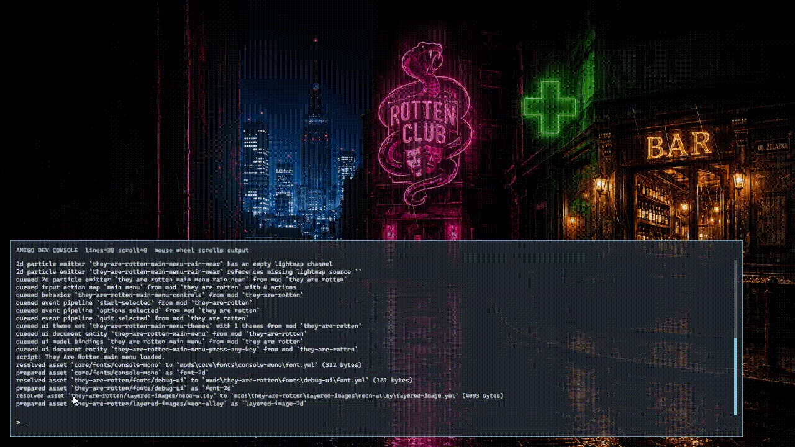

# Amigo




Amigo is a mod-first Rust monorepo for a 2D/3D runtime engine, launcher, and in-game tooling.

## Third-party notices

Open-source attribution and bundled third-party license notices live in
[THIRD_PARTY_NOTICES.md](THIRD_PARTY_NOTICES.md).

## Repository map (short)

```text
crates/
  apps/
    app/                 Runtime host / game application
    launcher/            TUI launcher

  foundation/            Core shared types and utilities
  engine/                Scene, runtime, input, audio, rendering APIs and devtools
  platform/              Host backends and platform adapters
  scripting/             Rhai integration and scripting interfaces
  2d/                    2D rendering/domain crates
  3d/                    3D rendering/domain crates
  ui/                    Shared UI runtime + layout kernel
  audio/                 Audio API and implementations
  tools/                 Developer tools

mods/                    Runtime content (core, playground-2d, playground-2d-particles, ...)
```

## Current architecture snapshot

```text
apps/app                 = thin host
runtime/bundles          = runtime composition + backend bridges
engine/devtools          = dev console, debug overlay, diagnostics
engine/editor-api        = placeholder editor contracts
engine/editor-session    = placeholder editor session state
engine/editor-authoring  = lazy authoring graph (dev/editor tooling)
engine/editor-ingame     = runtime in-game editor mockup
ui/layout                = shared layout kernel (amigo-ui-layout)
ui/core                  = runtime UI state/events/bindings
engine/render-wgpu       = rendering + overlay primitives (uses layout kernel)
```

`amigo-ui-layout` is the single source of truth for UI layout flow/measure/hit-test.
Both `amigo-ui` and `render-wgpu` adapt their node trees into this kernel.

## Running the project

### 1. Build app + launcher

From repo root:

```powershell
cargo check -p amigo-app
cargo check -p amigo-launcher
```

### 2. Run launcher + runtime

```powershell
# launcher (TUI)
cargo run -p amigo-launcher

# direct launch example (hosted mode)
cargo run -p amigo-launcher -- --hosted --mod=playground-2d --scene=screen-space-preview

# direct runtime (without launcher)
cargo run -p amigo-app -- --hosted --mods-root mods --mod=playground-2d --scene=screen-space-preview
```

### 3. Run in-game editor mode

```powershell
cargo run -p amigo-app -- --editor
```

`--editor` implies hosted + dev-mode defaults and starts with:

- mod: `playground-2d`
- scene: `screen-space-preview`
- in-game editor overlay enabled

## Recommended day-to-day commands

```powershell
# targeted checks
cargo check -p amigo-app
cargo check -p amigo-launcher
cargo check -p amigo-ui
cargo check -p amigo-render-wgpu

# targeted tests
cargo test -p amigo-ui layout
cargo test -p amigo-render-wgpu ui_overlay::tests::layout
cargo test -p amigo-editor-ingame
```

## Good first files to explore

- `crates/apps/launcher/src/main.rs` — launcher argument parsing + profiles
- `crates/apps/app/src/main.rs` — bootstrap settings for app runtime
- `crates/apps/app/src/bootstrap.rs` — runtime composition seam in app host
- `crates/runtime/bundles/` — composed runtime capability bundles
- `crates/ui/layout/` — shared layout kernel
- `crates/ui/core/src/runtime_ui.rs` — UI input/binding runtime loop
- `crates/engine/render-wgpu/src/ui_overlay/` — overlay layout adapters + primitives
- `crates/engine/editor-authoring/` — authoring scene graph service/cache
- `crates/engine/editor-ingame/` — in-game editor overlay/input/properties

## Notes

- There is no standalone desktop editor app in this repository at the moment.
- `editor-api` / `editor-session` stay placeholder-only by design.
- In-game editor is runtime/mock oriented (no YAML save pipeline yet).
